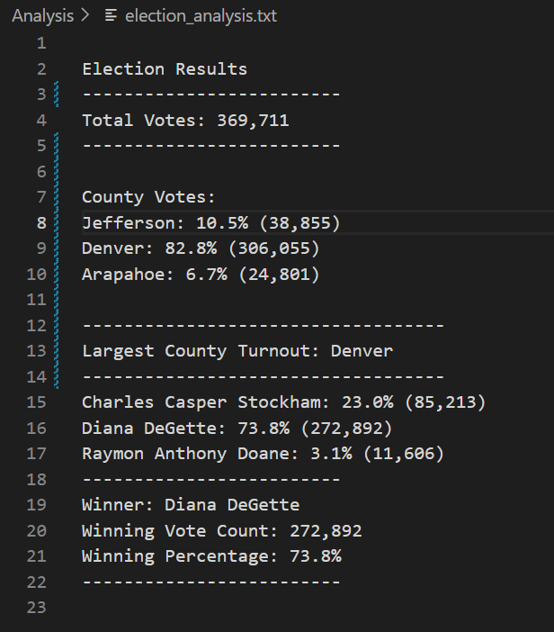

# Election Analysis

## Project Overview

We were asked to assist Tom, a Colorado Board of Elections employee, audit tabulated data containing the results of the Colorado Congressional Elections. A CSV file was giving to us, and using python and VS code we were able to report on total votes, total votes per candidate, percentage votes per candidate, and overall winner of the elections. 

In this challenge, we were also able to identify total votes per county, and pecentage of votes per county.

### Purpose

The purpose of this project is to provide the results of the Colorado congressional elections, broken down by candidate and by county, and to write a code that can be used to simply calculate and audit the results of other district and non-district elections.

## Election Audit Results

- How many votes were cast in this congressional election?

  A total of 369,711 votes were cast in the congressional election.

- Provide a breakdown of the number of votes and the percentage of total votes for each county in the precinct.

  There were 38,855 votes (10.5% of total votes) from Jefferson county, 306,055 votes (82.8% of total votes) from Denver county, and 24,801 votes (6.7% of total votes) from Arapahoe county.
  
- Which county had the largest number of votes?

  Denver County had the largest number of votes.
  
- Provide a breakdown of the number of votes and the percentage of the total votes each candidate received.
  - Charles Casper Stockham: 85,213 votes (23.0% of total votes)
  - Diana DeGette: 272,892 votes (73.8% of total votes)
  - Raymon Anthony Doane: 11,606 votes (3.1% of total votes)
- Which candidate won the election, what was their vote count, and what was their percentage of the total votes?
  
  Diana DeGette won the election with 272,892 votes, or 73.8% of total votes.
  
Please see below screenshot of the results:
  
  
  

## Election-Audit Summary

One ofthe advantages of Python is that you can reuse the code to perform the same analysis in similar projects. Currenlty, the code retrieves candidate's names and county names, which means that the code could be easily used for other district elections. However, the code could be modified to retrieve state names instead of county names in case of having a Federal election. One would have to change the variable names, and make sure that the code reference the correct index or column in `candidate_name = row[2]` and in `county_name = row[1]`.

Additionally, this code retrieves and writes information from and to a specif file and folder. For that reason, the lines of code `file_to_load = os.path.join("Resources/election_results.csv")` and `file_to_save = os.path.join("analysis", "election_analysis.txt")` would have to be updated.
If the raw data comes in a format different than CSV format, the `import CSV` dependency would have to be modified.

The way this code is written makes it easy to use it for different types of elections; it also makes it easy to update it, and to add to the code in case further analysis is required.

